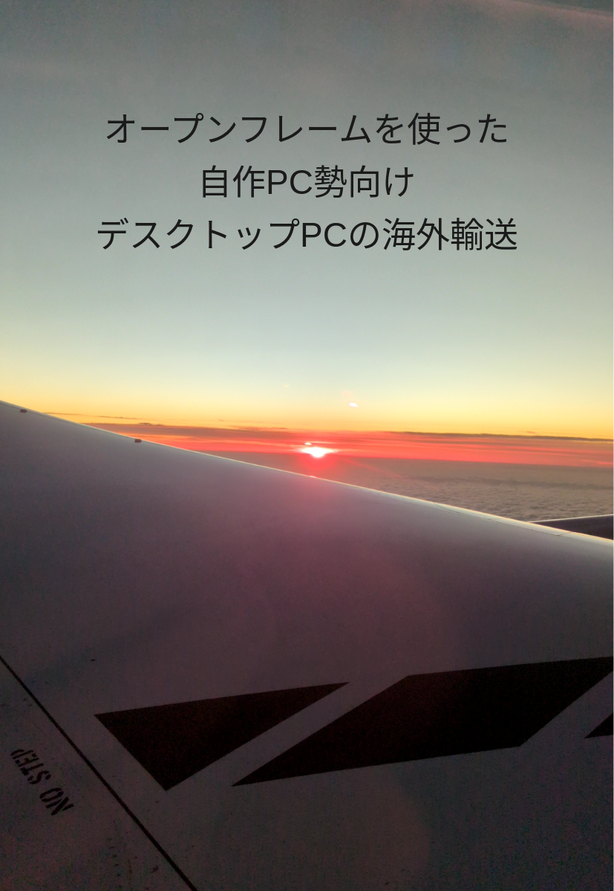

# 出版物について

- Booth: https://scepter914.booth.pm/

## 技術同人誌
### オープンフレームを使った自作PC勢向けデスクトップPCの海外輸送

販売ページ： https://scepter914.booth.pm/items/7656138

- 長期留学や海外駐在でデスクトップ機を持参する場合
- 研究におけるデモ発表や、ロボット競技（ロボコンなど）などの競技遠征でデスクトップ機が必要な場合
- 海外で新たに自作PCを作成するため、日本から一部パーツを持ち込む場合

以上のようなケースで、高性能GPUなどを前提とする計算資源を持ち運ぶことに興味のある方向けに、デスクトップPCを海外へ持ち運ぶための工程を手段の候補を洗い出しつつ、判断手順も含めて整理した技術ガイドです。
自分は家庭の事情から1年程度海外で住むことになったのですが、その時の経験を踏まえてこの技術同人誌を執筆しました。

## 旅行記
### ガイランゲルフィヨルドとソグネフィヨルドを巡る弾丸旅

販売ページ：
https://scepter914.booth.pm/items/7656138 PDF版
https://scepter914.booth.pm/items/7664066 PDF版 + 写真データ

本書は2025年夏に実行したノルウェー弾丸周遊の記録です。
ガイランゲルフィヨルドとソグネフィヨルドという二つの代表的な景勝地を一気に巡り、移動の組み方や現地での判断を、成功も失敗も含めて詳細に残しました。
迫力のある岩肌、自然の中をどんどん進んでいくフェリー旅、そんな断片を写真と文章で拾い集めました。
フィヨルドの雄大な景観と、そこに至るみちのりの数々。
旅の余白を、どうぞご一緒に体験していただければと思います。
