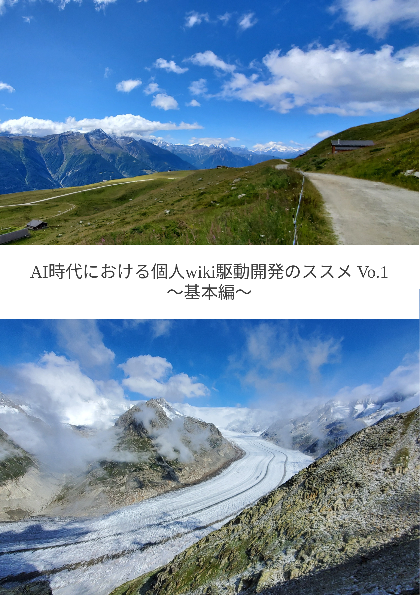
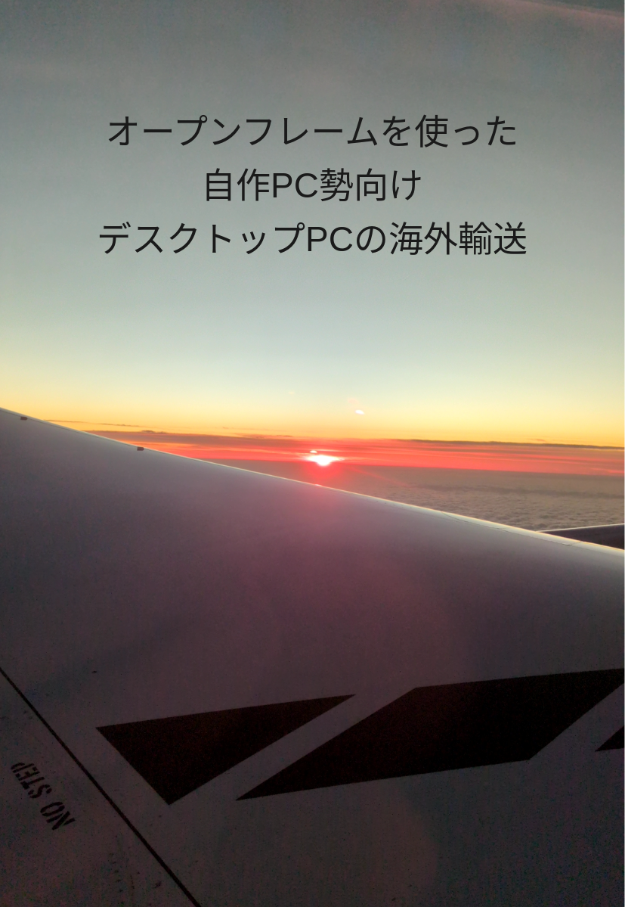
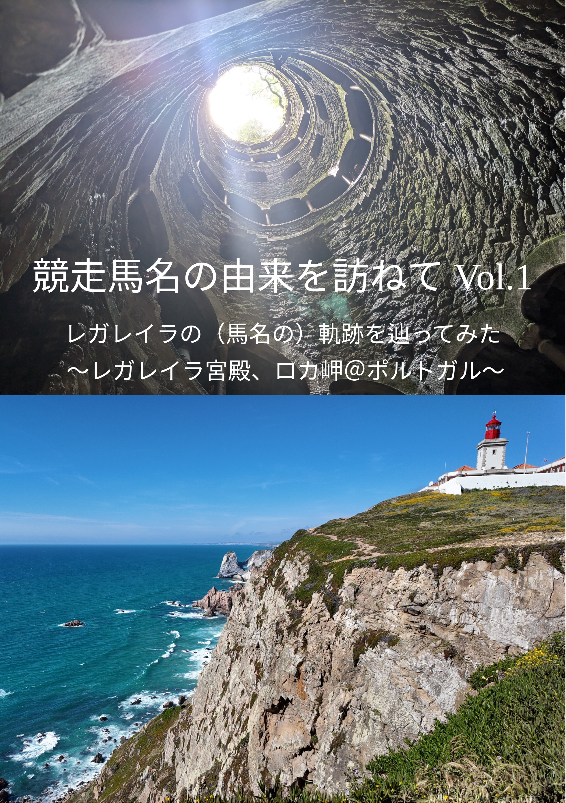
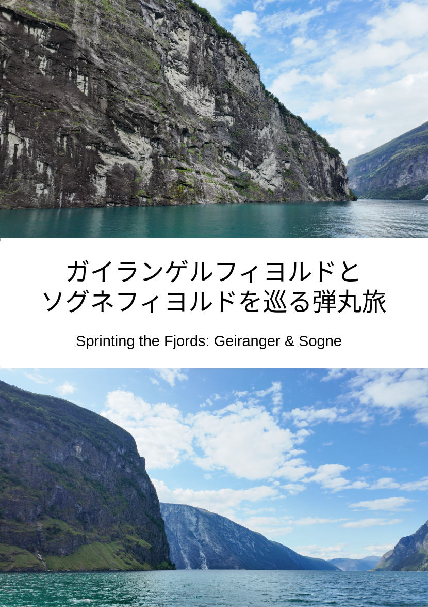

# 出版物について

- [Booth](https://scepter914.booth.pm/) にて販売中

## 技術同人誌
### AI時代における個人wiki駆動開発のススメ Vo.1 〜基本編〜

販売ページ： https://scepter914.booth.pm/items/8733990

AIに、毎回プロジェクトの背景を一から説明していませんか？
本書『AI時代における個人wiki駆動開発のススメ Vo.1 ～基本編～』では、個人Wikiを単なるメモ置き場ではなく、未来の自分とAIが共有する「外部記憶」として使う方法を紹介します。
VSCode＋Markdownを使い、まずは作業日誌を書くところから開始。日々の作業、調査、エラー、設計判断、失敗した試行錯誤を残しながら、自分専用のWikiを育てていきます。

本書では、

- VSCode＋Markdownでの個人Wiki構築
- AI時代に作業日誌を残す意味
- `todo.md`・`diary/`・`output/`を使ったWiki駆動開発
- AIの出力や判断経緯の残し方
- 技術同人誌執筆、論文調査などへの活用例

を実践例とともに解説します。

付録には、作業日誌・論文メモのテンプレート、フォルダ構成例、ChatGPT / AIツール用プロンプト集なども収録。
AIを使っているのに、過去の文脈が毎回リセットされてしまう。
そんな問題を、個人Wikiで解決するための基本をまとめた一冊です。

### オープンフレームを使った自作PC勢向けデスクトップPCの海外輸送

- 販売ページ： https://scepter914.booth.pm/items/7656138

長期留学や海外駐在でデスクトップ機を持参する場合
研究におけるデモ発表や、ロボット競技（ロボコンなど）などの競技遠征でデスクトップ機が必要な場合
海外で新たに自作PCを作成するため、日本から一部パーツを持ち込む場合

以上のようなケースで、高性能GPUなどを前提とする計算資源を持ち運ぶことに興味のある方向けに、デスクトップPCを海外へ持ち運ぶための工程を手段の候補を洗い出しつつ、判断手順も含めて整理した技術ガイドです。
自分は家庭の事情から1年程度海外で住むことになったのですが、その時の経験を踏まえてこの技術同人誌を執筆しました。

## 旅行記
### 「競走馬名の由来を訪ねて Vol.1 レガレイラの（馬名の）軌跡を辿ってみた 〜レガレイラ宮殿、ロカ岬＠ポルトガル〜」

- 販売ページ：https://scepter914.booth.pm/items/8733791

競走馬の「名前」の由来を、実際に訪ねてみました。
『競走馬名の由来を訪ねて Vol.1』で取り上げるのは、ホープフルステークス、有馬記念、エリザベス女王杯を制したレガレイラ。

レガレイラという馬名は、ポルトガル・シントラにある「レガレイラ宮殿」に由来します。
さらに母ロカの名前を辿ってみると、その由来はヨーロッパ大陸最西端の「ロカ岬」。
そして祖母ランズエッジの馬名は「地の果て」を意味します。

「地の果て」を意味するランズエッジ。
「ここに地果て、海始まる」の石碑が立つロカ岬を由来とするロカ。
そして、シントラの幻想的なレガレイラ宮殿を由来とするレガレイラ。
血統表の中に並ぶ馬名を、ポルトガルの地図と実際の風景の中で辿っていく旅行記です。

競走馬の名前の由来を知るだけでは終わらず、その名前が指す場所まで実際に足を運んでみると、血統表の向こう側に思っていた以上に広い世界が広がっていました。
レガレイラが好きな方はもちろん、競走馬の馬名や血統が好きな方、ポルトガルやシントラへの旅行に興味がある方にも楽しんでいただければと思います。

### ガイランゲルフィヨルドとソグネフィヨルドを巡る弾丸旅

- 販売ページ：https://scepter914.booth.pm/items/7656138

本書は2025年夏に実行したノルウェー弾丸周遊の記録です。
ガイランゲルフィヨルドとソグネフィヨルドという二つの代表的な景勝地を一気に巡り、移動の組み方や現地での判断を、成功も失敗も含めて詳細に残しました。
迫力のある岩肌、自然の中をどんどん進んでいくフェリー旅、そんな断片を写真と文章で拾い集めました。
フィヨルドの雄大な景観と、そこに至るみちのりの数々。
旅の余白を、どうぞご一緒に体験していただければと思います。
